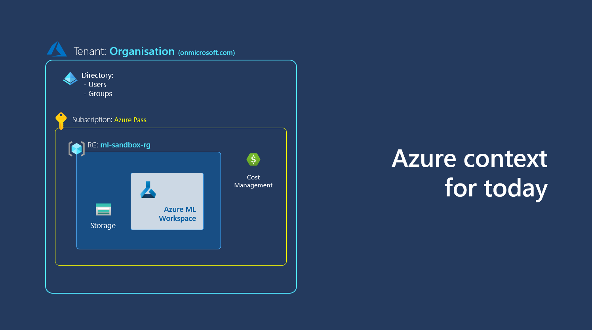
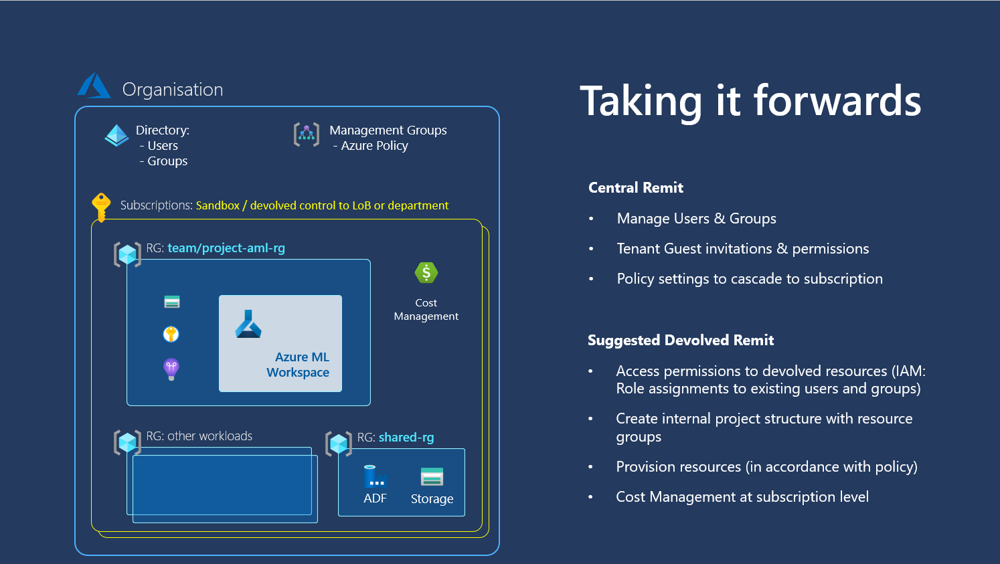

# Activate one Azure Pass per team

You must use a *personal* microsoft address to activate a sponsored Azure Pass (outlook.com, live.com etc). Do not use an address associated with an enterprise microsoft tenant. 

Only one person in each team needs to do this.

Activate your pass at aka.ms/azurepass

# Azure Orientation

On activation of an Azure Pass, a new subscription is created (yellow). A subscription can only exist within a `Tenant`. Usually an organisation will have only one tenant, but it may have many subscriptions.

So for the purpose of the Azure Pass, a dummy organisation will have been created on activation, usually named 'Default Directory', with an associated domain of `<name>.onmicrosoft.com` for its users.

> 1 Organisation : 1 Tenant : 1 Directory (of users)

**Further reading**
- Taking the Azure estate further ([below](#taking-the-azure-estate-further))

# Tenant setup

To use an azure pass tenant and subscription with multiple users, such as the members of a hack team, follow these steps:
1. [Add team users](#1-add-team-users)
2. [Create a group and add members](#2-create-a-group)
3. [Give the group the desired permissions](#)

## 1. Add team users

### 1 a) Guest users (Recommended)
For users that already have an email they use elsewhere with Microsoft or Azure (this could be your work email), give them guest access to the tenant:
[MSLearn: Invite a guest user](https://learn.microsoft.com/en-us/azure/active-directory/fundamentals/how-to-create-delete-users#invite-an-external-user)

Guest users must accept an invitation that they will receive by email, and can then log in at portal.azure.com with their own email.

> Note: Guest users will need to [switch directory](https://learn.microsoft.com/en-us/azure/devtest/offer/how-to-change-directory-tenants-visual-studio-azure) after logging in.

### 1 b) New users
For users that would like to have a new identity owned by this tenant, create a new user:
[MSLearn: Create a new user](https://learn.microsoft.com/en-us/azure/active-directory/fundamentals/how-to-create-delete-users#create-a-new-user)

## 2. Create a group and add members

- [MSLearn: Create a group](https://learn.microsoft.com/en-us/azure/active-directory/fundamentals/groups-view-azure-portal#create-a-new-group)
- [MSLearn: Add a group member](https://learn.microsoft.com/en-us/azure/active-directory/fundamentals/groups-view-azure-portal#add-a-group-member)

> **Note**: you can add members on creation of the group in a single step - find the `select members` link on the group creation page.

## 3. Give the group permissions

In this example, for the purpose of a hack with an Azure Pass subscription, we will give the group comprehensive permissions to act on everything at the subscription level and within that.  

> This also means we can proceed with this step before creating further resources within the subscription.

Follow the instructions below, with ***two modifications***:
- Instead of selecting the `Owner` role, select `Contributor`
- Instead of selecting a single user, select `the group created above`.
  
    [MSLearn: Assign administrative roles at the subscription level](https://learn.microsoft.com/en-us/azure/role-based-access-control/role-assignments-portal-subscription-admin)

# Subscription Setup

Before specific resources can be provisioned, the relevant providers have to be registered at the subscription level. 

Navigate to the `Resource providers` pane of the subscription in the portal, and register:
- Microsoft.MachineLearning

    [MSLearn: Register resource provider](https://learn.microsoft.com/en-us/azure/azure-resource-manager/management/resource-providers-and-types#register-resource-provider-1)

# Next steps

Please note the following when working within an Azure Pass sponsored supscription:
> :warning: Default compute quotas mean there is limited allowance for Azure Machine Learning VMs per region (a workspace resides in a particular region). 
>     
>     - use max 3 2-core compute instances for three users or teams of pair programmers working interactively (e.g. 3 DS11 machines) *OR* 1 DS12 machine for more intensive processing
>     - use 1 cluster of 4 F4 machines to explore multi-user clusters for job submission
>     - use 1 cluster of 1 NC6 machine to explore submission of GPU jobs

> :warning: Note that the Azure Pass subscriptions are **not enabled for provisioning the Azure OpenAI Service**.

- [provision an Azure Machine Learning workspace](https://learn.microsoft.com/en-GB/azure/machine-learning/quickstart-create-resources?view=azureml-api-2)

- [provision and work with Azure Cognitive Search](https://learn.microsoft.com/en-us/azure/search/search-get-started-portal)

 

# APPENDIX

### Taking the Azure Estate Further

See also documentation about established patterns that use subscriptions for a best-practice decentralised model based on `Landing zones` for isolated workloads in larger enterprises.

https://learn.microsoft.com/en-us/azure/cloud-adoption-framework/ready/enterprise-scale/

