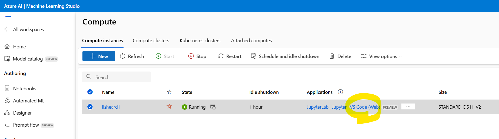
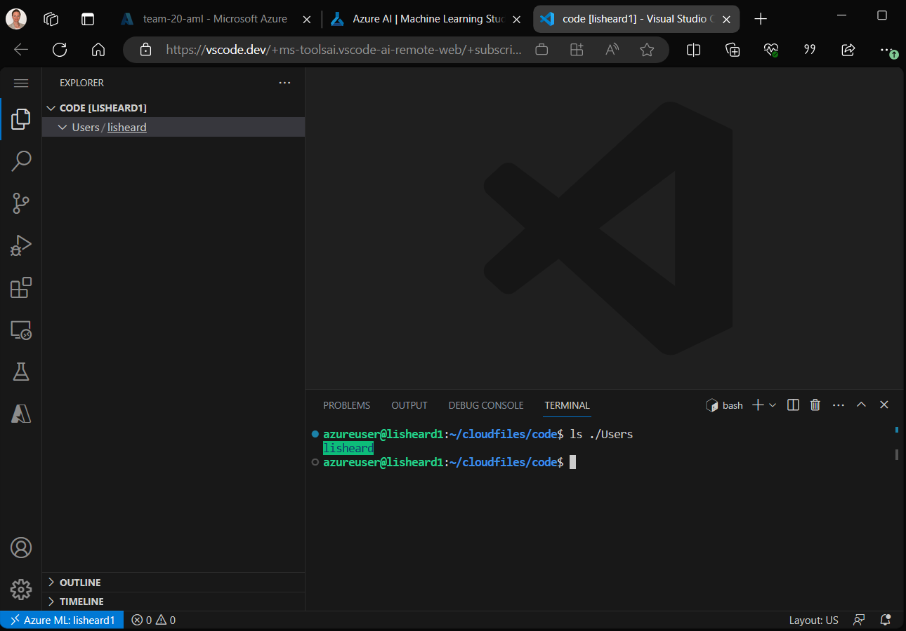
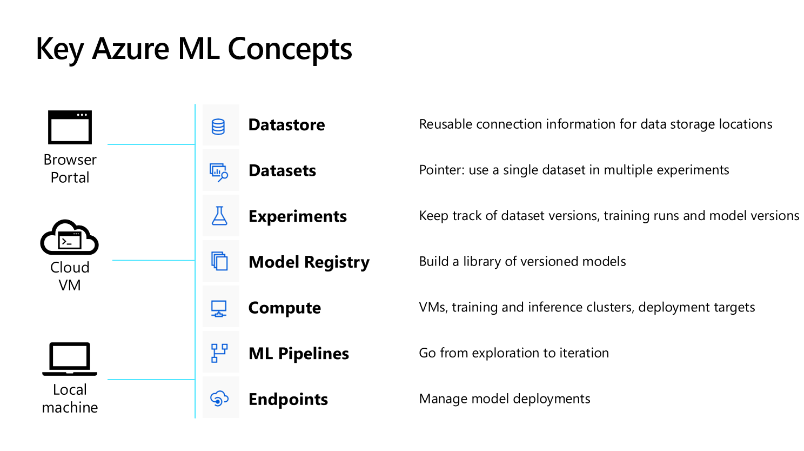
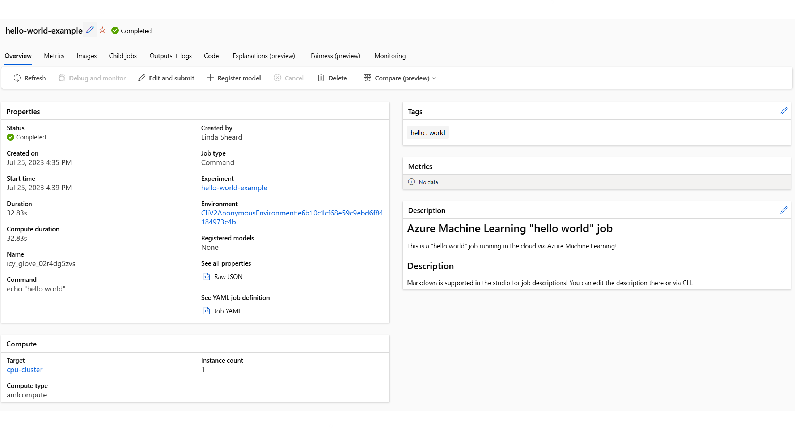

# Azure Machine Learning essentials

On this page, we will ensure you are set up to 
- [Work interactively](#a-interactive-access-via-portal) on an Azure Machine Learning VM (for example with notebooks)
- Explore [job submission](#b-job-submission-to-an-azure-ml-compute-target) to an Azure ML remote compute target, to learn about concepts such as pipelines and components

## Pre-requisites
Once per team:
- Work through the [Azure Pass Orientation](A-azure-pass-orientation.md) to set up the tenant and subscription for your team. 
- Follow the instructions linked there in the next steps section to provision an Azure Machine Learning workspace


## A. Interactive access via portal

#### 1. Navigate to https://ml.azure.com and verify that you can see your team's workspace.


#### 2. Subject to available quota, create a compute instance 
This is for interactive use of a single team member or pair programming team. 

> :warning: the default quota for CPU VM cores is 6 per region, allowing for three 2-core machines or one 4-core machine

[MSLearn: Create a compute instance](https://learn.microsoft.com/en-us/azure/machine-learning/how-to-create-compute-instance?view=azureml-api-2&tabs=azure-studio)

> :bulb: if your team needs more machines during the hack, you could create another workspace in a different region, or speak to proctors about raising a quota increase request - these can usually be serviced within the same day.

#### 3.  Review the sample notebooks
[MSLearn: Learn from sample notebooks](https://learn.microsoft.com/en-us/azure/machine-learning/quickstart-create-resources?view=azureml-api-2#learn-from-sample-notebooks)


### Useful links for interactive work:
- [What is an Azure Machine Learning Compute instance](https://learn.microsoft.com/en-us/azure/machine-learning/concept-compute-instance?view=azureml-api-2) *- includes guidance on managing tools, packages and kernels (conda environments)*


## B. Job submission to an Azure ML Compute target
Subject to networking settings of your Azure ML Workspace, it is possible to submit jobs and pipelines from anywhere that you can run python (with the [Azure ML python SDK v2](https://learn.microsoft.com/en-us/azure/machine-learning/concept-v2?view=azureml-api-2#azure-machine-learning-python-sdk-v2)), or install the [Azure ML CLI v2](https://learn.microsoft.com/en-us/azure/machine-learning/concept-v2?view=azureml-api-2#azure-machine-learning-cli-v2).

'Anywhere' could therefore be a local orchestration machine, a cloud VM, anywere you can run python notebooks, or a Devops Agent. 

To illustrate, we will be using a compute instance provided by Azure ML, along with the integrated VSCode web interface (preview) so that we can explore the CLI.

> :bulb: When working from a compute instance, the CLI will be preinstalled. To install it elsewhere, see [Install and set up the CLI (v2)](https://learn.microsoft.com/en-us/azure/machine-learning/how-to-configure-cli?view=azureml-api-2&tabs=public)

With a running compute instance, launch the VScode web interface:


VScode will launch in the browser. Hit `Ctrl + '` to launch a terminal.



> :bulb: In the illustration above, note that the working directory resides inside of `~/cloudfiles/code/Users/<username>`. Everthing within `~/cloudfiles/code` is in fact a mounted Azure blob storage directory, which means that this can be accessed from the portal, and also regardless of which compute instance the interface is launched on.

You can verify that the Azure ML CLI is installed with 

```bash
az ml -h
```

This shows a list of subcommands that will loosely align to the key concepts shown here: 




From here, we'll work through the following steps:
  1. log into the azure command line tooling and connect to the workspace
  2. clone this repo
  3. create a compute target using the cli (if not exists)
  4. submit an example job

### 1. Log into the azure command line
```bash
az login --tenant <your-tenant-name>.onmicrosoft.com --use-device-code

```

### 2. Set defaults to connect to your workspace
The VM we're working in is agnostic to the fact that it has been provided by am Azure ML workspace, so we still have to provide settings for the cli to point it at the workspace we want to operate on. Permission is based on the identity of the user logged in to the Azure CLI.

```bash
az configure -d \
  location=westeurope \
  group=<your-resource-group-name> \
  workspace=<your-workspace-name>
```

You can verify settings with 
```bash
az configure --list-defaults
```

Or you can test the connection by for example listing available compute
```bash
az ml compute list -o table
```


### 3. Create a compute cluster
> :warning: if you have already created a cluster of F2 machines, you may not have enough quota. Skip this step and point to your existing cluster in the next step.

In this example we will specify parameters inline, rather than using a yaml file as we will see later

```bash

az ml compute create -n cpu-cluster \
  --type AMLCompute \
  --size STANDARD_F4S_V2 \
  --min-instances 0 \
  --max-instances 4 \
  --idle-time-before-scale-down 300
```

### 4. Submit a simple job

In your VSCode web interface, create a new YML file in the working directory called `hello-world.yml`, and adapt [this example](https://learn.microsoft.com/en-us/azure/machine-learning/reference-yaml-job-command?view=azureml-api-2#yaml-display-name-experiment-name-description-and-tags) to use your compute cluster as a target, by adding a line anywhere that specifies:

```yml
commpute: azureml: <name of the cpu cluster created above> 
```

Save the file in the working directory, and then run

```bash
az ml job create -f ./hello-world.yml
```
In the Azure ML Workspace portal, watch a node being provisioned in the compute cluster, and watch the experiment pane for your job execution logs.



**A few notes about this example:**
> :bulb: This example simply executes an echo statement in the target compute. Review some of the other examples to see how to upload a source code directory (`code: ./my/local/srcdir`) that becomes the working directory in the target compute, and excute python or R scripts
>
> :bulb: This example does not implement any multi-node distribution, so only one of the four available nodes in the target cluster is spun up
>
> :bulb: This example references a simple python image - you can customise this with your own image or additional conda dependencies needed by your code
>
> :bulb: This example is a single command job. Review the [pipeline schema](https://learn.microsoft.com/en-us/azure/machine-learning/reference-yaml-job-pipeline?view=azureml-api-2) to see how to define a pipeline job where individual steps can be submitted to different compute targets. 


### Useful links for working with remote compute targets
- [What are compute targets in Azure Machine Learning](https://learn.microsoft.com/en-us/azure/machine-learning/concept-compute-target?view=azureml-api-2)


# Further Reading
- [About Azure ML compute targets](https://learn.microsoft.com/en-gb/azure/machine-learning/concept-compute-target?view=azureml-api-2)